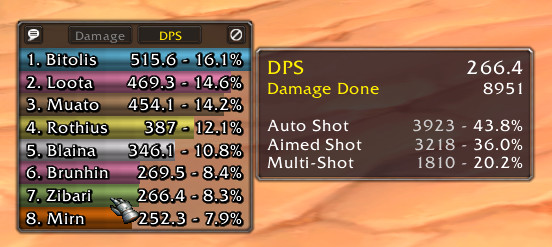
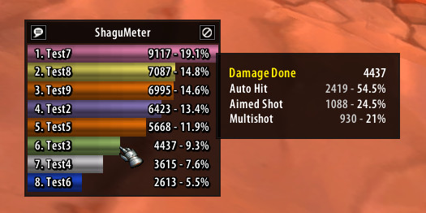

# ShaguMeter

A very small and lightweight damage meter. The combat log is parsed locale-independent and should work on every 1.12 vanilla based client.
It does not have much functionality and will not gain much more features.

**Don't expect to see anything fancy here.**





## Installation
1. Download **[Latest Version](https://github.com/shagu/ShaguMeter/archive/master.zip)**
2. Unpack the Zip file
3. Rename the folder "ShaguMeter-master" to "ShaguMeter"
4. Copy "pfSimpleDamage" into Wow-Directory\Interface\AddOns
5. Restart Wow

## Commands

The following commands can be used to access the settings:
* **/shagumeter**
* **/meter**
* **/sm**

If one is already used by another addon, just pick an alternative command.
Available options are:

```
/sm visible 1        Show main window (0 or 1)
/sm width 180        Bar width (any number)
/sm height 17        Bar height (any number)
/sm bars 8           Visible Bars (any number)
/sm trackall 0       Track all nearby units (0 or 1)
/sm texture 2        Set the statusbar texture (1 to 4)
/sm pfui 1           Inherit pfUI theme if available (0 or 1)
/sm toggle           Toggle visibility of the main window
```
